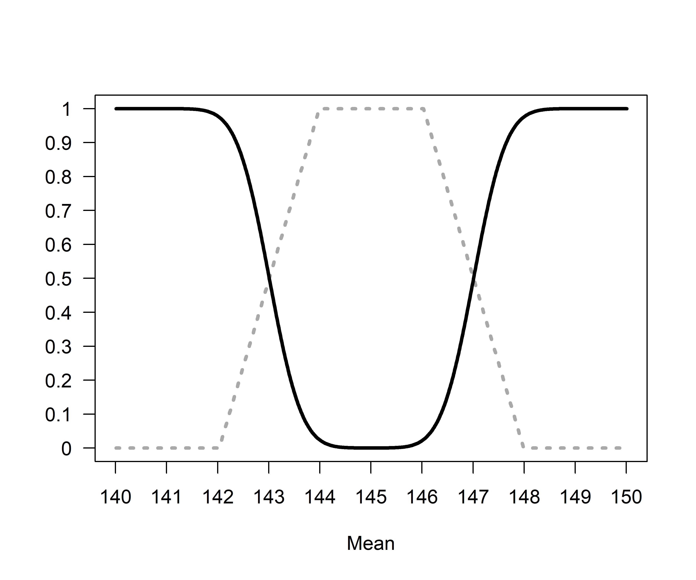
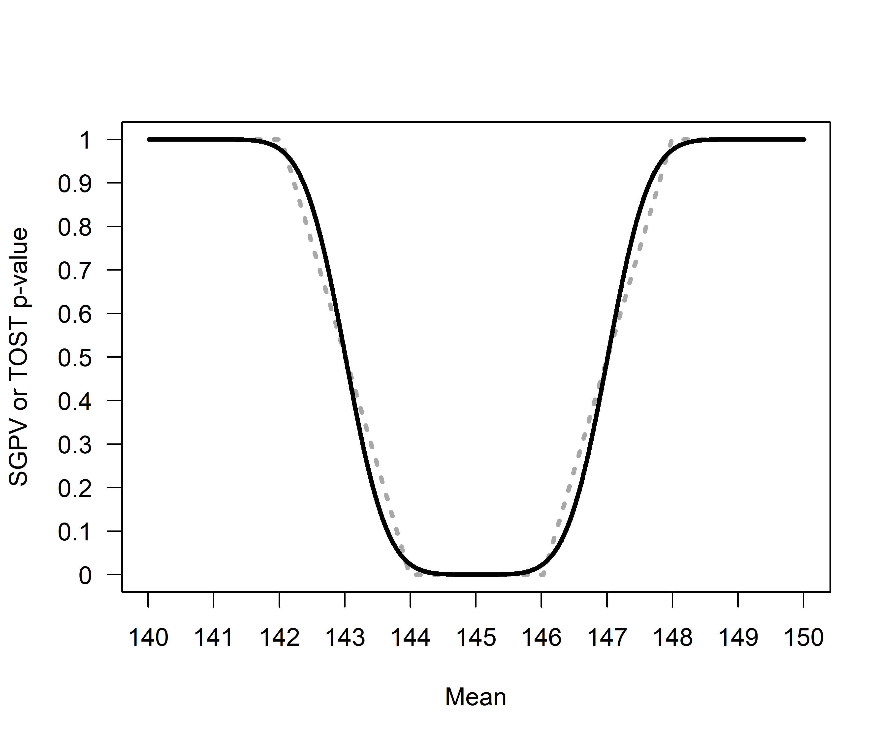
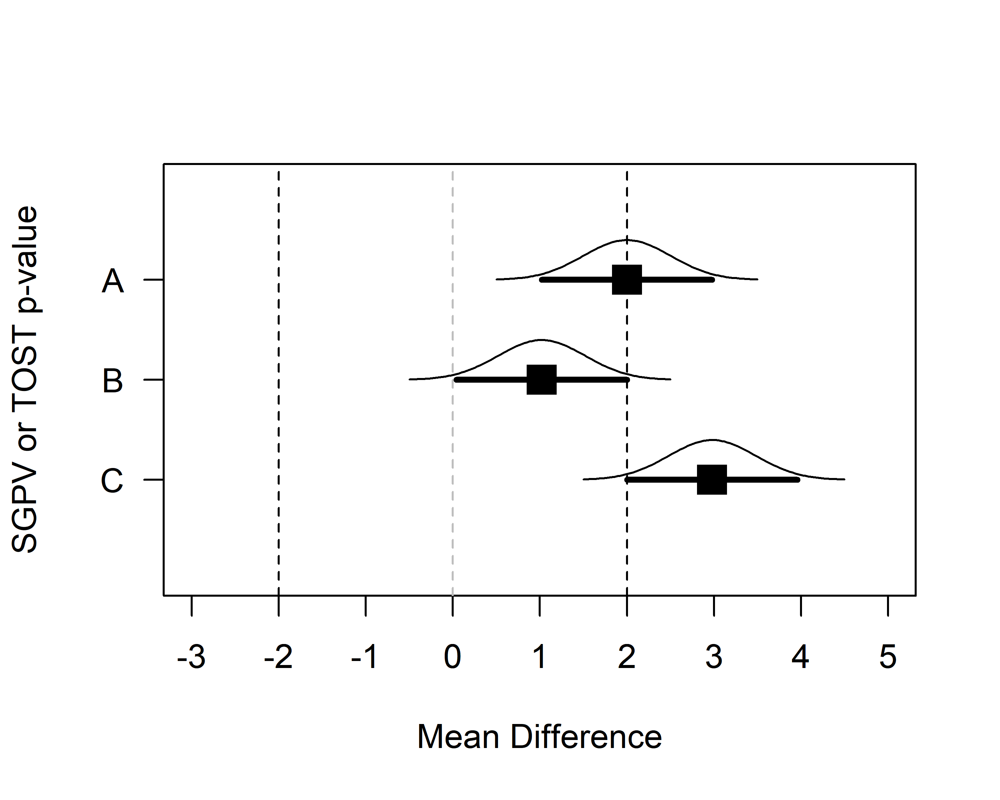
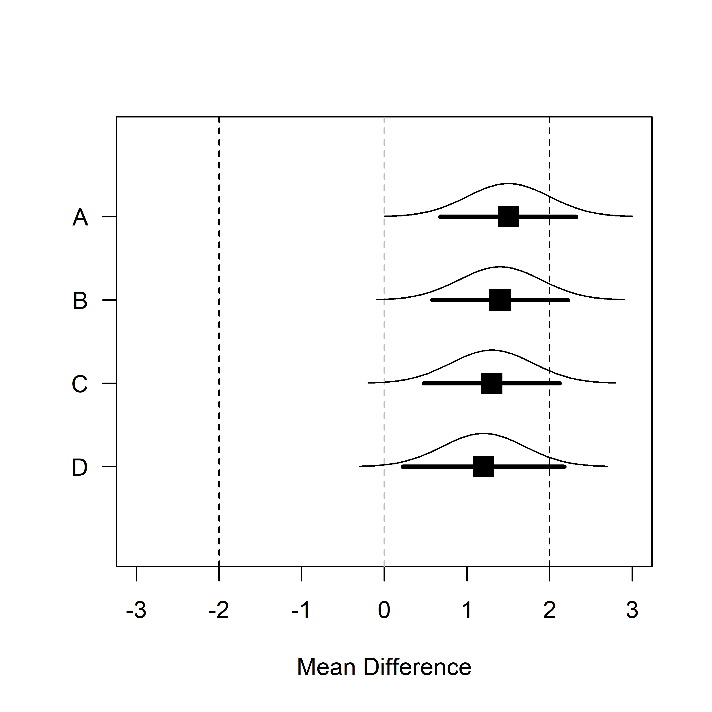

Equivalence Testing and the Second Generation P-Value
================
Daniël Lakens & Marie Delacre
19 juli 2018

The RMarkdown file with the reproducible code of this text is [here](https://github.com/Lakens/TOST_vs_SGPV/blob/master/sgpv_vs_TOST.Rmd).

The second generation *p*-value (SGPV) is a new descriptive statistic that was recently proposed to "improve rigor, reproducibility and transparency across science" (Blume, McGowan, Dupont, & Greevy, 2018). The SGPV is 'the proportion of data-supported hypotheses that are also null hypotheses'. The researcher specify an equivalence range around the null hypothesis that specifies values that are considered practically equivalent to the null-hypothesis. The SGPV is the proportion of the 95% confidence interval (CI) around the observed effect estimate that falls within this equivalence range. If the 95% [Do we always use a alpha of 5%? I know it is suggested by Schuirman (1987) but if we could use other alpha value we should rather use (1-alpha)*100 %?] CI falls completely inside the equivalence range the SGPV is 1, or if falls completely outside the SGPV is 0.

The SGPV has clear similarities with an already existing approach that compared the data to an equivalence range, known as equivalence testing (Lakens, 2017; Rogers, Howard, & Vessey, 1993). In the Two One-Sided Tests (TOST) procedure data is tested against the upper and lower bounds of the equivalence range. If both one-sided tests indicate that the presence of effects that fall outside of the equivalence range (or in other words, when a 90% CI falls completely within the equivalence range) an equivalence test can be used to support the absense of a meaningful effect [I don't really understand this sentence. Words missing? Do you mean somathing like "If both one-sided tests reject the presence of effects more extreme than the bounds (or in other words, if a (1-2alpha)*100% CI falls completely within the equivalence range), it supports the absense of a meaningful effect"?]. Surprisingly, Blume et al (2018) do not discuss equivalence testing in their article, despite the strong conceptual similarities. Here, we aim to examine the similarities and differences between equivalence testing using the TOST procedure and the SGPV.

The relationship between *p*values from TOST and SGPV
=====================================================

In the plot below *p*-values are calculated for the TOST equivalence testing procedure where a true population mean ranging from 140 to 150 is compared to the test value of 145 in a one-sample equivalence test where equivalence bounds are set to difference of -2 and +2 around the test value of 145. In other words, the equivalence range in the test contains all means between 143 and 147. For clarity, sample sizes consist of 1000000 observations [what's your motivation at using n = 1000000? From my view, except for the fact that with very big n, the CI is similar whatever we use "t" or "z", one has the exact same pattern using more realistic n and sd values (same overlaps, etc.). However, maybe you have something in mind I haven't think of?]. The population standard deviation is set to 500.

 *Figure 1*: Comparison of *p*-values from TOST (black line) and SGPV (dotted grey line) across a range of true population means (x-axis) tested against a mean of 145 in a one-sample *t*-test with a sample size of 1000000 and a standard deviation of 500.

The SGPV treats the equivalence range as the null-hypothesis, while the TOST procedure treats the values outside of the equivalence range as the null-hypothesis. For ease of comparison we can reverse the SGPV (by calculating 1-SGPV) to make the two tests more comparable. We see that the *p*-value from the TOST procedure and the SGPV follow each other closely. 

*Figure 2*: Comparison of *p*-values from TOST (black line) and 1-SGPV (dotted grey line) across a range of true population means (x-axis) tested against a mean of 145 in a one-sample *t*-test with a sample size of 1000000 and a standard deviation of 500.

When the population mean is 145 and we are testing against equivalence bounds of 143 and 147 using the TOST procedure for a one-sample *t*-test with a sample size of 1000000 and a standard deviation of 500, the equivalence test is significant, *t*(999999) = 4, *p* = 0.0000317. Because the 95% CI falls completely within the equivalence bounds, the SGPV is 1 (see Figure 1).

One the other hand, if the observed mean is 140, the equivalence test is not significant (the observed mean is far outside the equivalence range of 143 to 147), *t*(999999) = -6, *p* = 1[1 is rounded because p=1 is impossible, so shouldn't we rather use "p > .999"?]. Because the 95% CI falls completely outside the equivalence bounds, the SGPV is 0 (see Figure 1).

SGPV as a uniform measure of overlap 
------------------------------------

It is clear the SGPV and the *p*-value from TOST are closely related. We can think of the SGPV as a straight line that will always overlap the *p*-value from an equivalence test in 3 points. When the TOST *p*-value is 0.5, the SGPV is also 0.5 [it's not relevant to mention it here or maybe in a footnote, but the reverse is not systematically true. SGPV also equals .5 when |H0| is enterely included within |CI| & 2*|H0|< |CI|, because SGPV = |H0|/(2*|H0|)=1/2]. The SGPV is 50% when the observed mean falls exactly on the lower or upper equivalence bound [but also when there is a big lack of accuracy due to very small n or too small |H0|, i.e. |CI| > 2*|H0|,
as explained in my previous comment]. When the observed mean equals the equivalence bound, the difference between the mean in the data and the equivalence bound is 0, the *t*-value for the equivalence test is also so, and thus the *p*-value is 0.5 (situation A).

 *Figure 3*: Means, normal distribution, and 95% CI for three example datasets that illustrate the relationship between *p*-values from TOST and SGPV.

Two other points always have to overlap. When the 95% CI falls completely, but only just inside the equivalence region, the TOST (which relies on a one-sided test) should be significant at an alpha level of 0.025. When the SGPV reaches 1 [I know I am counting how many angels can dance on the head of a pin. ... but the jump from .9999 and 1 depends on the measure accuracy. A p-value is continuous so I don't really like this formulation] the 95% CI just touches the equivalence bound (see situation B in the plot above, where the 95% CI falls completely inside the equivalence bounds) and the TOST *p*-value is 0.025. The third point where the SGPV and the *p*-value from the TOST procedure should overlap is where the SGPV changes from a positive value (i.e., 0.0001) to 0 (when the 95% CI completely falls outside of the equivalence bound, see situation C in the plot above). When the 95% CI touches the outside of the equivalence bound and the TOST *p*-value will be 0.975.

The confidence interval width is uniformly distributed across the mean differences, in the sense that as the true mean in a one-sample t-test gets closer to the test value (in Figure 4, from situation A to D, the mean gets closer to the test value by 0.1) the difference in the overlap is stable.

 *Figure 4*: Means, normal distribution, and 95% CI for data with a sample size of 1000000 and a standard deviation of 500 for samples where the true population mean is 1.5, 1.4, 1.3, and 1.2.
 

For example, the SGPV from A to D is 0.7551064, 0.8061277, 0.857149, and 0.9081703. The difference in the percentage of overlap between A and B (-0.0510213) is identical to the difference in the percentage of overlap between C and D as the mean gets 0.1 closer to the test value (-0.0510213).

As we move the means closer to the test value in steps of 0.1 across A to D the TOST c*p*-value calculated for normally distributed data is not uniformly distributed. The probability of observing data more extreme than the upper bound of 2 is (from A to D) 0.1586553, 0.1150697, 0.0807567, and 0.0547993. As we can see, the difference between A and B (0.0435856) is not the same as the difference between C And D (0.0259574). Indeed, the difference in *p*-values is the largest as you start at *p* = 0.5 (when the observed mean falls on the test value), which is why the line in Figure 1 is the steepest at *p* = 0.5. Note that where the SGPV reaches 1 or 0, *p*-values closely approximate 0 and 1, but never reach these values.

What does SGPV add to Equivalence Testing? 
------------------------------------------

Given the strong relationship between SGPV and equivalence testing, a logical question is to ask what a SGPV adds to our statistical toolbox. First of all, SGPV is a descriptive statistic (unlike the *p*-value that is calculated for an equivalence test, which is an inferential statistic). It numerically summarizes the information that is visually present in a plot (such as Figure 3) displaying the equivalence range and the 95% CI around the observed effect.

As a descriptive statistic it is somewhat limited. SGPV is 1 for a range of values (see Figure 1) where the *p*-values for the TOST procedure range differ (e.g., different equivalence tests with *p* = 0.049 and *p* = 0.0001 have a SGPV of 1 [Are you sure?? I think only tests with p <=.025 have a SGPV of 1. p_tost = .05 means that the 90% CI just touches the equivalence bound. The 95% CI is therefore not entirely included within |H0| and the SGPV cannot be 1] [I think that Blume et al. could say that most of the time, researchers interpret p-value dichotomously; cf. the Neyman-Pearson approach. BTW, they use the delta gap when different SGPV = 0. I'm surprised they don't envisage a measure to compare two SGPV = 1]). Although a SGPV of 1 or 0 has a clear interpretation (we can reject effects outside or inside the equivalence range [As I already told you, I'm not totally OK that SGPV = 0 should have a clear interpretation... it's exactly like having a p_tost > .975. Should we consider that a p > .975 supports the non equivalence? Maybe only in a "descriptive" sense]) intermediate values are not as easy to interpret (e.g., it is unclear how we would interpret a SGPV of 0.56 versus 0.65). Since the SGPV is always directly related to a *p*-value from the TOST procedure, different SGPV can be interpreted in the same manner as different *p*-values. From a Fisherian viewpoint, the lower the *p*-value, the worse the fit of the data with a specific model [maybe we should precise something like "i.e. the lower the TOST p-value, the worse the fit of the data with a model of non equivalence... you will maybe find it useless but I'm afraid people who don't fully understand TOST and SPVG would read it quickly and think a low TOST p-value is similar as a low SGPV], and analogously, the lower the SGPV the worse the fit of the data with the equivalence range. From a Neyman-Pearson approach to statistics, only the dichotomous rejection of values outside of the equivalence range (TOST *p* &lt; *α* or SGPV = 1) allows you to act as if the null-hypothesis is true while controlling our error rate at a known maximum. [it's interesting that the cut-off to support the equivalence is not the same with TOST procedure and SGPV. Equivalence is more often supported by the TOST procedure than by the SGPV approach, since with the TOST procedure, only the 90% has to be included within |H0| and with the SGPV approach, the 95% has to be included within |H0|]

It seems Blume et al (2018) were not aware of the existence of equivalence tests, and we believe that our explanation of the similarities between the TOST procedure and the SGPV provides some useful context to interpret the contribution of second generation *p*values. The novelty, it seems to us, mainly lies in its use as a descriptive statistic, but the added benefit of calculating the proportion of overlap of a 95% CI with the equivalence range for practical purposes remains somewhat unclear [well there is at least one clear benefit: simplicity. As underlined by Cumming and Finch: "interval information [...] is accessible and comprehensible [...] they s upport substantive understanding and interpretation" (2001, p.533)]. Nevertheless, our only goal is to clarify the relationship between a newly proposed statistic and the already existing TOST approach used to test for equivalence, and let researchers make an informed decision about which statistical approach provides the best answer to their question.

References
==========

Blume, J. D., McGowan, L. D., Dupont, W. D., & Greevy, R. A. (2018). Second-generation *p*-values: Improved rigor, reproducibility, & transparency in statistical analyses. PLOS ONE, 13(3), e0188299. <https://doi.org/10.1371/journal.pone.0188299> Lakens, D. (2017). Equivalence Tests: A Practical Primer for t Tests, Correlations, and Meta-Analyses. Social Psychological and Personality Science, 8(4), 355–362. <https://doi.org/10.1177/1948550617697177> Rogers, J. L., Howard, K. I., & Vessey, J. T. (1993). Using significance tests to evaluate equivalence between two experimental groups. Psychological Bulletin, 113(3), 553–565. <http://dx.doi.org/10.1037/0033-2909.113.3.553>
