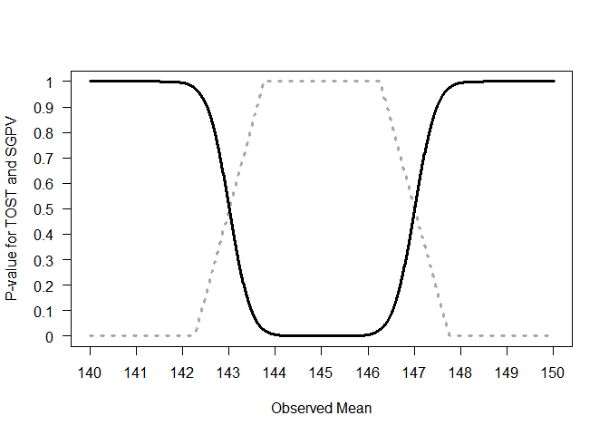
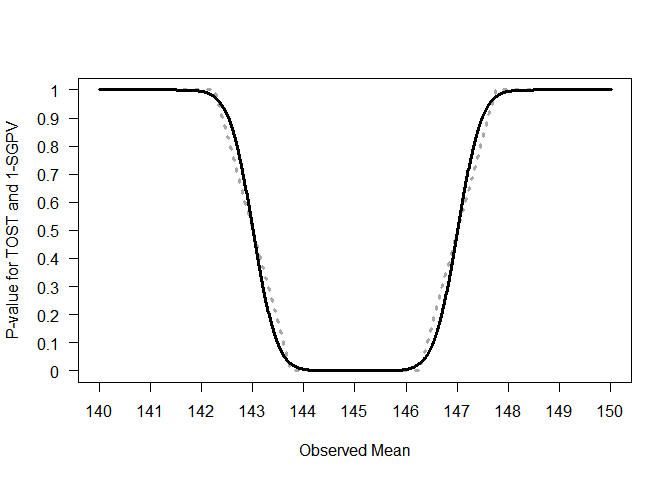
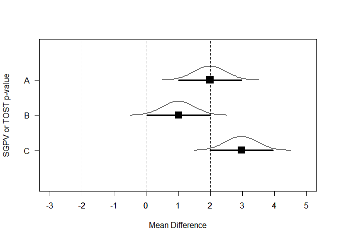
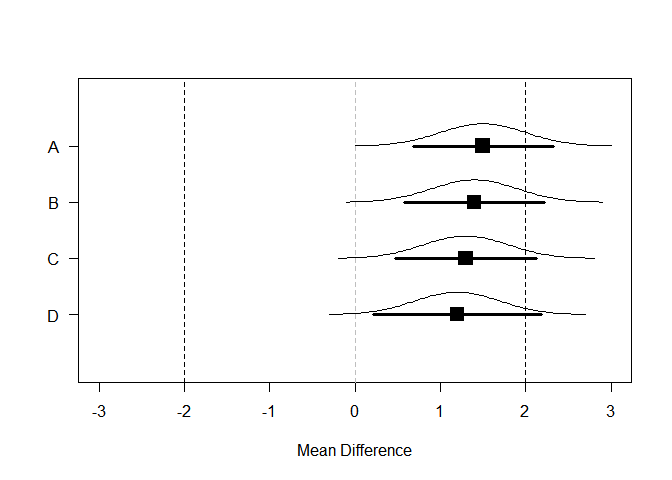
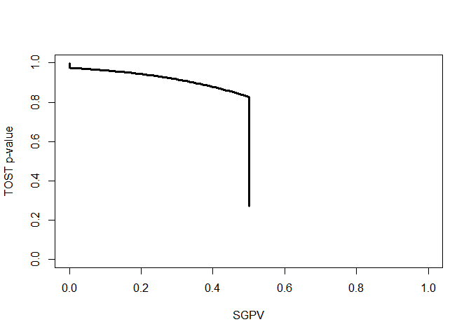
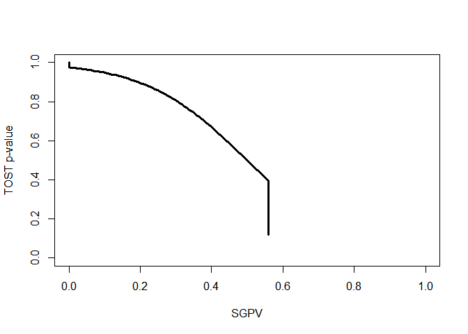
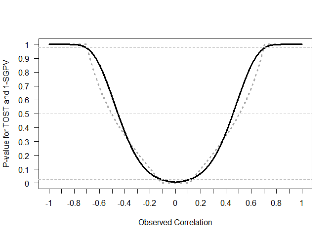
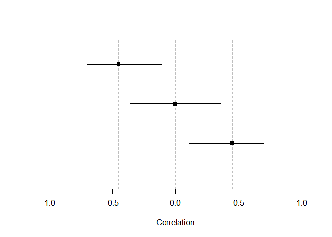
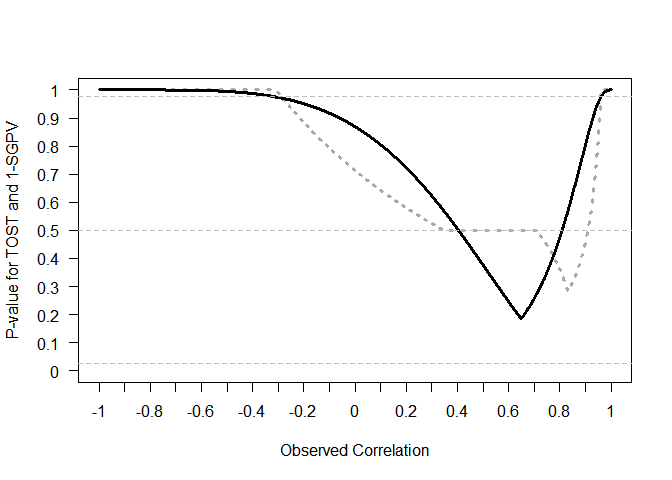

Equivalence Testing and the Second Generation P-Value
================
Daniël Lakens & Marie Delacre

To test predictions most researchers predominantly rely on null-hypothesis tests. This statistical approach can be used to examine whether observed data is sufficiently surprising under the null hypothesis to reject an effect size of zero. Null-hypothesis tests have an important limitation, in that this procedure can only reject the hypothesis that there is no effect, while scientists should also be able to provide statistical support for *equivalence*. When testing for equivalence researchers aim to examine whether the effect is practically zero, or that there is no meaningful effect. By specifying a range around the null hypothesis of values that are deemed practically equivalent to the absence of an effect (i.e., 0 ± 0.3) the observed data can be compared against an *equivalence range* and researchers can test if a meaningful effect is absent \[@hauck\_new\_1984;@kruschke\_rejecting\_2018;@rogers\_using\_1993;@serlin\_rationality\_1985;@spiegelhalter\_bayesian\_1994;@wellek\_testing\_2010;@westlake\_use\_1972\].

Second generation *p*-values (SGPV) were recently proposed to as a descriptive statistic that represents ‘the proportion of data-supported hypotheses that are also null hypotheses’ \[@blume\_second-generation\_2018\]. The researcher specifies an equivalence range around a classical simple null hypothesis of parameter values that are considered practically equivalent to the null hypothesis. The SGPV measures the degree to which a set of data-supported parameter values falls within the interval null hypothesis. If the estimation interval falls completely within the equivalence range, the SGPV is 1. If the confidence interval falls completely outside of the equivalence range, the SGPV is 0. Otherwise the SGPV is a value between 0 and 1 that expresses the overlap of data-supported hypotheses and the equivalence range. When calculating the SGPV the set of data-supported parameter values can be represented by a confidence interval (CI) or credible intervals or Likelihood support intervals (SI). When a confidence interval is used, the SGPV and equivalence tests such as the Two One-Sided Tests (TOST) procedure \[@lakens\_equivalence\_2017;@meyners\_equivalence\_2012;@schuirmann\_comparison\_1987\] appear to have close ties. Here, we aim to examine the similarities and differences between the TOST procedure and the SGPV.

The TOST procedure also relies on the confidence interval around the effect. In the TOST procedure the data is tested against the lower equivalence bound in the first one-sided test, and against the upper equivalence bound in the second one-sided test \[@lakens\_equivalence\_2018\]. If both tests allow you to reject an effect as extreme or more extreme than the equivalence bound, you can reject the presence of an effect large enough to be meaningful, and conclude the observed effect is practically equivalent to zero. Because one-sided tests are performed, one can also conclude equivalence by checking whether the 1-2\*alpha confidence interval (e.g., when the alpha level is 0.05, a 90% CI) falls completely within the equivalence bounds. Because both equivalence tests as the SGPV are based on whether and how much a confidence interval overlaps with equivalence bounds, it seems logical to compare the behavior of the newly proposed SGPV to equivalence tests.

The relationship between *p*-values from TOST and SGPV when confidence intervals are symmetrical
================================================================================================

The second generation *p*-value (SGPV) is calculated as:
$$
  p \_ { \\delta } = \\frac { \\left| I \\cap H \_ { 0 } \\right| } { | I | } \\times \\max \\left\\{ \\frac { | I | } { 2 \\left| H \_ { 0 } \\right| } , 1 \\right\\}
$$
 where I is the interval based on the data (e.g., a 95% confidence interval) and H0 is the equivalence range. The first term of this formula implies that the second generation *p*-value is the width of the confidence interval that overlaps with the equivalence range, divided by the total width of the confidence interval. The second term is a 'small sample correction' (which will be discussed later) that comes into play whenever the confidence interval is more than twice as wide as the equivalence range.

To examine the relation between the TOST *p*-value and the SGPV we can calculate both statistics across a range of observed effect sizes. In *p*-values are plotted for the TOST procedure and the SGPV. The statistics are calculated for hypothetical one-sample *t*-tests for observed means ranging from 140 to 150 (on the x-axis). The equivalence range is set to 145 ± 2 (i.e., an equivalence range from 143 to 147), the observed standard deviation is assumed to be 2, and the sample size is 100. For example, for the left-most point in the SGPV and the TOST *p*-value is calculated for a hypothetical study with a sample size of 100, an observed standard deviation of 2, and an observed mean of 140, where the *p*-value for the equivalence test is 1, and the SGPV is 0. Our conclusions about the relationship between TOST *p*-values and SGPV in this article are not dependent upon any specific example.

The SGPV treats the equivalence range as the null-hypothesis, while the TOST procedure treats the values outside of the equivalence range as the null-hypothesis. For ease of comparison we can reverse the SGPV (by calculating 1-SGPV in Figure ) to make the values more easily comparable. We see that the *p*-value from the TOST procedure and the SGPV follow each other closely.

When the observed sample mean is 145, the sample size is 30, and the standard deviation is 2, and we are testing against equivalence bounds of 143 and 147 using the TOST procedure for a one-sample *t*-test, the equivalence test is significant, *t*(29) = 5.48, *p* &lt; .001. Because the 95% CI falls completely within the equivalence bounds, the SGPV is 1 (see Figure ).

On the other hand, if the observed mean is 140, the equivalence test is not significant (the observed mean is far outside the equivalence range of 143 to 147), *t*(29) = -8.22, *p* = 1 (or more accurately, *p* &gt; .999 as *p*-values are bounded between 0 and 1). Because the 95% CI falls completely outside the equivalence bounds, the SGPV is 0 (see Figure ).

SGPV as a uniform measure of overlap
------------------------------------

It is clear the SGPV and the *p*-value from TOST are closely related. When confidence intervals are symmetric we can think of the SGPV as a straight line that is directly related to the *p*-value from an equivalence test for three values. When the TOST *p*-value is 0.5, the SGPV is also 0.5 (note that the reverse is not true). The SGPV is 50% when the observed mean falls exactly on the lower or upper equivalence bound, because 50% of the symmetrical confidence interval overlaps with the equivalence range. When the observed mean equals the equivalence bound, the difference between the mean in the data and the equivalence bound is 0, the *t*-value for the equivalence test is also 0, and thus the *p*-value is 0.5 (situation A, ).

Two other points always have to overlap. When the 95% CI falls completely (but only just) inside the equivalence region, the TOST (which relies on a one-sided test) should be significant at an alpha level of 0.025. When the SGPV changes from &lt;1 to 1 the 95% CI touches one of the equivalence bounds (see situation B in , where the 95% CI falls completely inside the equivalence bounds) and the TOST *p*-value is always 0.025. The third point where the SGPV and the *p*-value from the TOST procedure should overlap is where the SGPV changes from a positive value to 0 (i.e., when the 95% CI falls completely outside of the equivalence range, but touches one of the equivalence bounds, see situation C in ). When the 95% CI touches the outside of the equivalence bound and the TOST *p*-value will be 0.975.

The confidence interval width is uniformly distributed across the mean differences. As the observed mean in a one-sample *t*-test gets closer to the test value (in the plot below, from situation A to D, the mean gets closer to the test value by 0.1) the difference in the overlap is stable.

For example, the SGPV from A to D is 0.76, 0.81, 0.86, and 0.91. The difference in the percentage of overlap between A and B (-0.05) is identical to the difference in the percentage of overlap between C and D as the mean gets 0.1 closer to the test value (-0.05).

As we move the observed mean closer to the test value in steps of 0.1 across A to D the *p*-value calculated for normally distributed data is not uniformly distributed. The probability of observing data more extreme than the upper bound of 2 is (from A to D) 0.159, 0.115, 0.081, and 0.055. As we can see, the difference between A and B (0.044) is not the same as the difference between C And D (0.026). Indeed, the difference in *p*-values is the largest as you start at *p* = 0.5 (when the observed mean falls on the test value), which is why the line in is the steepest at *p* = 0.5. Note that where the SGPV reaches 1 or 0, *p*-values closely approximate 0 and 1, but never reach these values. \#\#When are the SGPV and Equivalence Test Unrelated? There are 4 situations where *p*-values from TOST and SGPV are unrelated. The first two situations were discussed earlier, and can be seen in . When the SGPV is either 0 or 1 *p*-values from the equivalence test fall between 0.975 and 1 or between 0 and 0.025. Because *p*-values approach 0 or 1, but are never exactly 0 or 1, while the SGPV is exactly 0 or 1, the two statistics are completely unrelated. The easiest way to see this is by plotting the SGPV against the *p*-value from the TOST procedure. The situations where the SPGV and *p*-values from the TOST procedure are unrelated are indicated by the parts of the curve where there are vertical lines at SGPV of 0 and 1.

A third situation in which the SGPV deviates strongly from the TOST *p*-value is whenever the CI is more than twice as wide as the equivalence range, and the CI overlaps with the upper *and* lower equivalence bound. In this situation the normal calculation of the proportion of overlap is skipped, and the SGPV is set to 0.5 instead. @blume\_second-generation\_2018 call this the 'small sample correction factor'. However, it is not a correction in the typical sense of the word, since the SGPV is not adjusted to any 'correct' value. When the normal calculation would be 'misleading' (i.e., the SGPV would be small, which normally would suggest support for the alternative hypothesis, when all values in the equivalence range are also supported), the SGPV is set to 0.5 which according to Blume and colleagues signal the SGPV is 'uninformative'. Note that the CI can be twice as wide as the equivalence range whenever the sample size is small (and the confidence interval width is large) *or* when then equivalence range is narrow. It is therefore not so much a 'small sample correction' as it is an exception to the typical calculation of the SGPV whenever the ratio of the confidence interval width to the equivalence range exceeds 2:1 and the CI overlaps with the upper and lower bounds.

We can examine this situation by calculating the SGPV and performing the TOST for a situation where sample sizes are small and the equivalence range is narrow, such that the CI is more than twice as large as the equivalence range.

We can again plot the two statistics against each other to see where they are unrelated (indicated by straight lines in the curve, see ). We see the SGPV is 0.5 for a range of observed means where the *p*-value from the equivalence test still varies. It should be noted that in these calculations the *p*-values for the TOST procedure are *never* smaller than 0.05 (i.e., they do not get below 0.05 on the y-axis). In other words, we cannot conclude equivalence based on any of the observed means. How is this possible? Remember that the TOST procedure consists of two one-sided tests against the upper and lower equivalence bound. The TOST *p*-value is smaller than 0.05 if the 90% CI falls completely between the upper and lower equivalence bounds. However, we are examining a scenario where the 90% CI is so wide that it never falls completely within the two equivalence bounds. As @lakens\_equivalence\_2017 notes: “in small samples (where CIs are wide), a study might have no statistical power (i.e., the CI will always be so wide that it is necessarily wider than the equivalence bounds).” None of the *p*-values based on the TOST procedure are below 0.05, and thus, in the long run we have 0% power.

There is one last situation where the *p*-value from the TOST procedure and the SGPV are unrelated. This is when the CI is wider than the equivalence range (so the precision is low) and overlaps with the upper and lower equivalence bound, but the CI is *not* twice as wide as the equivalence range. This fourth category exists because of the decision by Blume and colleagues to set the SGPV to 0.5 whenever the CI is twice as wide as the equivalence range and the CI overlaps with both equivalence bounds. This means that there are situations where the CI interval overlaps with both equivalence bounds, while the CI is less than twice as large as the equivalence bound. For example, in the example below, we see that the CI is only 1.79 times as wide as the equivalence bounds, but the CI overlaps with the lower and upper equivalence bounds.

If the observed mean would be somewhat closer to 0, or further away from 0, the SGPV would remain constant (the CI width does not change, it completely overlaps with the equivalence range) while the *p*-value for the TOST procedure can vary between 0 and .025. We can see this in below. The SGPV is not set to 0.5, but is slightly higher than 0.5 across a range of means. How high the SGPV will be when the CI overlaps with the lower and upper equivalence bounds, but the CI is not twice as large as the equivalence range, depends on the width of the CI and the equivalence range.

If we once more plot the two statistics against each other to see where they are unrelated (indicated by straight lines in the curve), we see the SGPV is 0.56 for a range of observed means where the *p*-value from the equivalence test still varies.

To conclude this section, there are four situations where the *p*-value from the TOST procedure is unrelated to the SGPV. In all these situations the *p*-value for the equivalence test differentiates tests with different means, but the SGPV does not. Therefore, as a purely descriptive statistic, the SGPV is more limited than the value from the TOST procedure. The proportion of overlap can be the same value when the observed mean is 0 or when the observed mean falls just inside the equivalence bound, and additional information (e.g., the 95% CI) is required to differentiate these situations. One way to mitigate this limitation of the SGPV would be to set the SGPV to 0.5 whenever the CI overlaps with both the upper and lower equivalence bound (irrespective of the width of the CI).

The relation between equivalence tests and SGPV when confidence intervals are not symmetrical
---------------------------------------------------------------------------------------------

So far we have only looked at the relation between equivalence tests and the SGPV when confidence intervals are symmetric (e.g., for confidence intervals around mean differences). For correlations, which are bound between -1 and 1, confidence intervals are only symmetric for a correlation of exactly 0. The confidence interval becomes increasingly asymmetric as the observed correlation nears -1 or 1. For example, with ten observations, an observed correlation of 0 has a symmetric 95% confidence interval ranging from -0.629 to 0.629, while and observed correlation of 0.7 has an asymmetric 95% confidence interval ranging from 0.126 to 0.992.

The effect of assymetric confidence intervals is most easily noticable at smaller sample sizes, therefore in below we plot the *p*-values from equivalence tests and the SGPV (again plotted as 1-SGPV for ease of comparison) for correlations. The sample size is 30 pairs of observations, and the lower and upper equivalence bounds are set to -0.45 and 0.45, with an alpha of 0.05. As the observed correlation in the sample moves from -1 to 0 the *p*-value from the equivalence test becomes smaller, as does 1-SGPV. The pattern is quite similar to that in . The *p*-value for the TOST procedure and 1-SGPV are still identical when *p*-values are 0.975 and 0.025 (indicated by the upper and lower horizontal dotted lines). There are two important differences, however. First of all, the SGPV is no longer a straight line, but a curve, due to the asymmetry in the 95% CI. Second, and most importantly, the *p*-value for the equivalence test and the SGPV do no longer overlap at *p* = 0.5.

The reason that the equivalence test and SGPV no longer overlap is also because of asymmetric confidence intervals. If the observed correlation falls exactly on the equivalence bound the *p*-value for the equivalence test indicates that the probability of observing the observed or more extreme data, assuming the equivalence bound is the true effect size, is 50%. In other words, if the true effect size is the same as the equivalence bound, it is equally likely to find an effect more extreme than the equivalence bound, as it is to observe an effect that is less extreme than the equivalence bound. However, as can be seen in , the two second generation *p*-values associated with the observed correlations at r = -0.45 and r = 0.45 are 0.581. Because the confidence intervals are asymmetric around the observed effect size of 0.45 (ranging from 0.11 to 0.7) according to @blume\_second-generation\_2018 58.1% of the data-supported hypotheses are null hypotheses, and therefore 58.1% of the data-supported hypotheses are compatible with the null premise.

This example illustrates the difference between a proportion and a probability. There is always a 50% probability of observing a correlation smaller or larger than the true correlation, but the SGPV for this situation depends on how far away the observed correlation is from 0. The further away from 0, the larger the SGPV when the observed mean falls on the equivalence bound. The SGPV is the proportion of values in a 95% confidence interval that overlap with the equivalence range, but not the probability that these values will be observed. In the most extreme case (i.e., a sample size of 4, and equivalence bounds set to r = -0.99 and 0.99, with an observed correlation of 0.99) 97.6% of the confidence interval overlaps with the equivalence range, even though in the long run only 50% of the correlations observed in the future will fall in this range. It should be noted that in larger sample sizes the SGPV is closer to 0.5 whenever the observed correlation falls on the equivalence bound, but this extreme example nevertheless clearly illustrates the difference between two different questions the SGPV and a *p*-value are answers to. The conclusion of this in depth look at asymmetric confidence intervals is that a SGPV of 1 or 0 can still be interpreted the same way as a *p*-value of 0.025 and 0.975 can be interpreted in an equivalence test, since the SGPV and *p*-value for the TOST procedure are always directly related at these values. Although @blume\_second-generation\_2018 state that "the degree of overlap conveys how compatible the data are with the null premise" this definition of what the SGPV provides does not hold for asymmetric confidence intervals. Although a SGPV of 1 or 0 can be directly interpreted, a SGPV between 0 and 1 is not interpretable as 'compatibility with the null hypothesis'. Indeed, Blume and colleagues write in the supplemental material that "The magnitude of an inconclusive second-generation *p*-value can vary slightly when the effect size scale is transformed. However definitive findings, i.e. a *p*-value of 0 or 1 are *not* affected by the scale changes."

What are the Relative Strengths and Weaknesses of Equivalence Testing and SGPV?
-------------------------------------------------------------------------------

Given the strong relationship between SGPV and equivalence testing, a logical question is to ask what the introduction of SGPV adds to the existing statistical approaches, including equivalence tests, and what the relative strengths and weaknesses of either approach are. First of all, SGPV is a descriptive statistic (unlike the *p*-value that is calculated for an equivalence test, which is an inferential statistic). It numerically summarizes the information that is visually present in a plot of the equivalence range and the confidence interval around the observed effect (for example, see ).

A possible weakness of the SGPV is that even though a SGPV of 1 or 0 has a clear interpretation (we can reject effects outside or inside the equivalence range), intermediate values are not as easy to interpret (especially for effects that have asymmetric confidence intervals). This is not too problematic, since the main use of the SGPV (e.g., in all examples provided by Blume and colleagues) is to examine whether the SGPV is 0 or 1, or whether the SGPV is inconclusive. This interpretation of a SGPV as allowing researchers to reject the null, reject the presence of a meaningful effect, or remaining inconclusive is very similar to the Neyman-Pearson interpretation of combining a null-hypothesis test and an equivalence test (@lakens\_equivalence\_2018). The difference is that where a SGPV of 1 can be interpreted as *p* &lt; .05, and equivalence test provides an exact *p*-value, and continues to differentiate between for example p = 0.048 and p = 0.002. *P*-values continue to differentiate for situations where the SGPV are identical. For example, different equivalence tests with *p* = 0.048 and *p* = 0.002 have a SGPV of 1. Whether this is desireable depends on the perspecitve that is used. From a Neyman-Pearson perspective on statistical inferences the main conclusion is based on whether or not *p* &lt; *α*, and thus an equivalence test and SGPV can be performed by simply checking whether the confidence interval falls within the equivalence range, just as a null-hypothesis test can be performed by checking whether the confidence interval contains zero or not. At the same time, it is recommended to report exact *p*-values \[@american\_psychological\_association\_publication\_2010\], and exact *p*-values might provide information of interest to readers about how surprising the data is under the null model. Equivalence tests combined with null-hypothesis significance tests also allow researchers to conclude an effect is significant *and* equivalent (i.e., statistically different from zero, but also too small to be considered meaningful). Thus, the SGPV is used to classify results into one of three possible outcomes (with the data falling inside or outside the equivalence range, or being inconclusive), while equivalence tests combined with null-hypothesis tests classify results into four possible outcomes.

An important issue when calculating the SGPV is its reliance on the 'small sample correction', where the SGPV is set to 0.5 whenever the ratio of the confidence interval width to the equivalence range exceeds 2:1 and the CI overlaps with the upper and lower bounds. This exception to the normal calculation of the SGPV is introduced to prevent misleading values. Without this correction it is possible that a confidence interval is extremely wide, and an equivalence range is extremely narrow, which without the correction would lead to a very low value for the SGPV. @blume\_second-generation\_2018 suggest that under such a scenario 'the data favor alternative hypotheses', even when a better interpretation would be that there is not enough data to accurately estimate the true effect compared to the width of the equivalence range. Although it is necessary to set the SGPV to 0.5 whenever the ratio of the confidence interval width to the equivalence range exceeds 2:1, it leads to a range of situations where the SGPV is set to 0.5, while the *p*-value from the TOST procedure continues to differentiate (see for example ). An important benefit of equivalence tests is that is does not need such a correction to prevent misleading results.

As a more extreme example of the peculiar behavior of the 'small sample correction' as currently implemented in the calculation of the SGPV see below. In this figure observed correlations (from a sample size of 10) from -1 to 1 are tested against an equivalence range from r = 0.4 to r = 0.8. We can see the SGPV has a peculiar shape because it is set to 0.5 for certain observed correlations, even though there is no risk of meaningless SGPV in this range. This example suggests that the current implementation of the 'small sample correction' could be improved. If, on the other hand, the SGPV is mainly meant to be interpreted when it is 0 or 1, it might be preferable to simply never apply the 'small sample correction'.

@blume\_second-generation\_2018 argue that the SGPV has improved error control, in that the conclusion that the 95% confidence interval lies completely outside the equivalence range around zero will necessarily occur less frequently than a Type I error in a null-hypothesis test (where the 95% confidence interval only needs to not overlap with zero). However, the SGPV has a *lower* error rate, not a *more accurate* error rate. In a Neyman-Pearson perspective (which forms the basis of equivalence tests) the goal is not to end up with an error rate that is as low as possible (to achieve that, one simply adjusts the alpha level), but with a decision procedure that, when applied, yields a desired error rate with high accuracy. Traditional frequentist tests such as equivalence tests, null-hypothesis tests, and minimal effect tests (which have the same goal as the SGPV to test whether a confidence interval falls completely outside the equivalence range) make it straightforward to control the Type 1 error rate, as well as the Type II error rate by performing an a-priori power analysis. Note that the TOST procedure uses a 90% confidence interval (because it is based on two one-sided tests, the confidence interval is 1-2\**α*, but because both tests need to be significant to conclude equivalence, no adjustment for multiple comparisons is needed). Therefore, the TOST procedure always has higher power to declare equivalence than the SGPV, which relies on a 95% confidence interval.

@blume\_second-generation\_2018 claim that "Adjustments for multiple comparisons are obviated" (p. 15) and that "second-generation p-values provide a proper scientific adjustment for multiple comparisons". However, this is not correct. Even when for a single test the probability of concluding there is a meaningful effect (where the confidence interval falls outside of the equivalence range) is lower than the probability that there is any effect, with a sufficient number of looks and narrow confidence intervals error rates can rise above the nominal alpha level. More importantly, multiple comparisons inflate the probability that one erronously concludes there is *no* effect, where there *is* a true effect size that equals the equivalence bound, just as quickly for the SGPV as for null-hypothesis testing. To conclude, the idea that the SGPV improves error rates does not hold up under closer scrutiny, and the recommendation to ignore adjustments for multiple comparisons has the potential to increase false positives in the literature. Equivalence tests provide and easier and more formal way to control error rates.

Conclusion
==========

We believe that our explanation of the similarities between the TOST procedure and the SGPV provides some useful context to interpret the contribution of second generation *p*-values to the statistical toolbox. The novelty lies in its use as a descriptive statistic, but this use can be limited when confidence intervals are asymmetrical, or wider than the equivalence range. There are strong similarities with *p*-values from the TOST procedure, and in all situations where the statistics yield different results, the behavior of the *p*-value from the TOST procedure is more consistent, and easier to interpret. We hope this overview of the relationship between the SGPV and equivalence tests will help researchers to make an informed decision about which statistical approach provides the best answer to their question. Our comparisons shows that when proposing alternatives to null-hypothesis tests, it is important to compare new proposals to already existing procedures. We believe equivalence tests achieve the goals of the second generation *p*-value while allowing users to more easily control error rates, and while yielding more consistent statistical outcomes.
