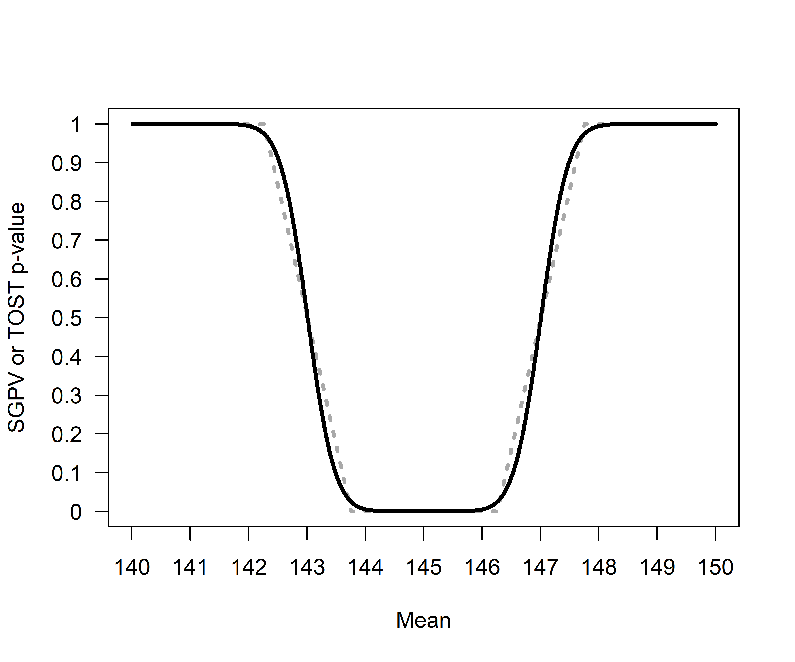
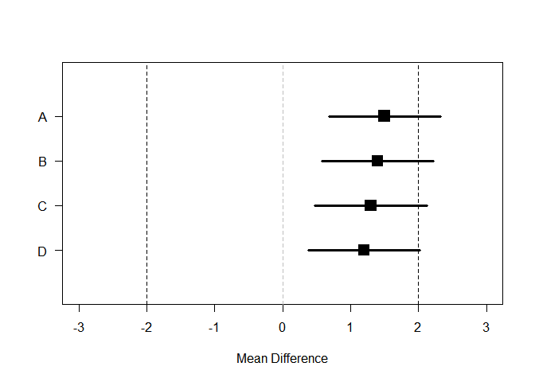
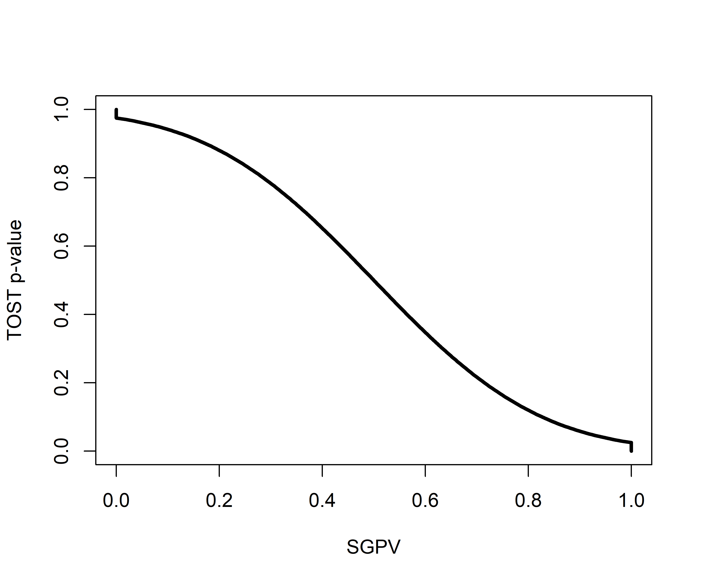
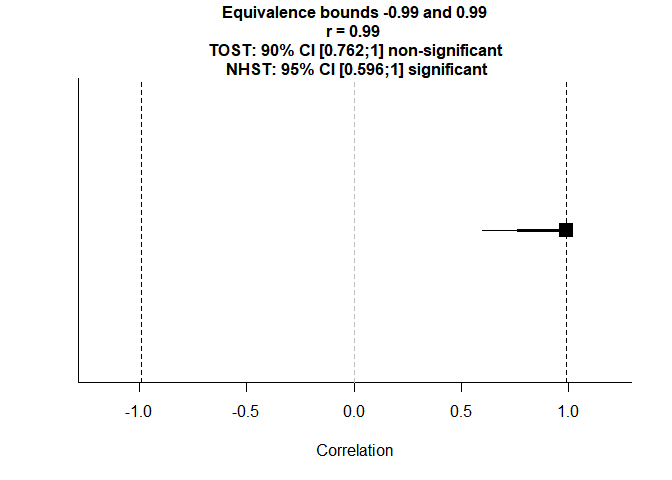
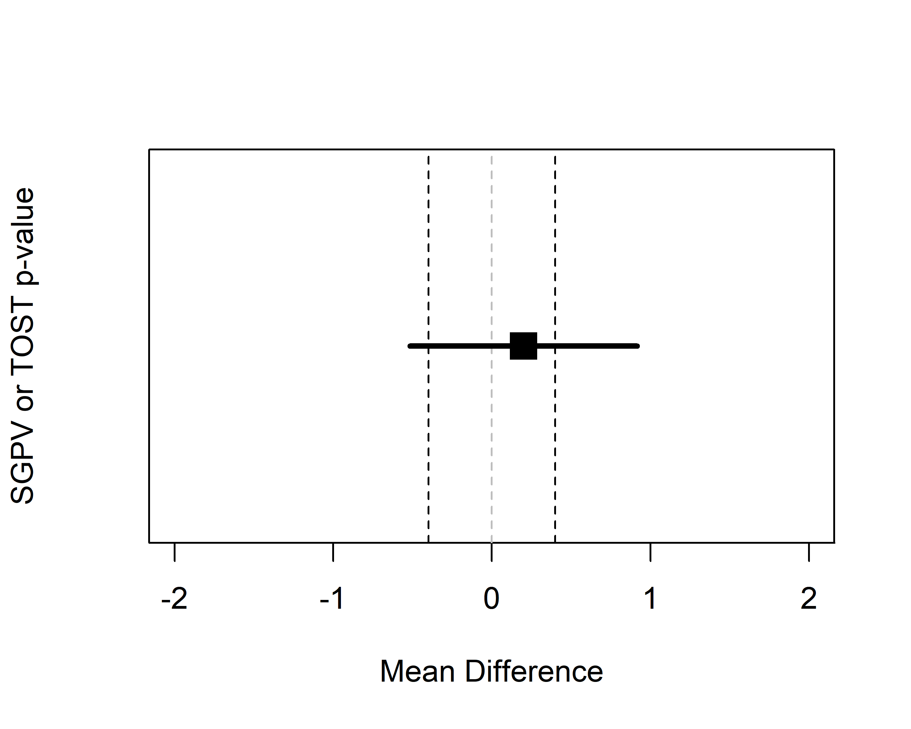
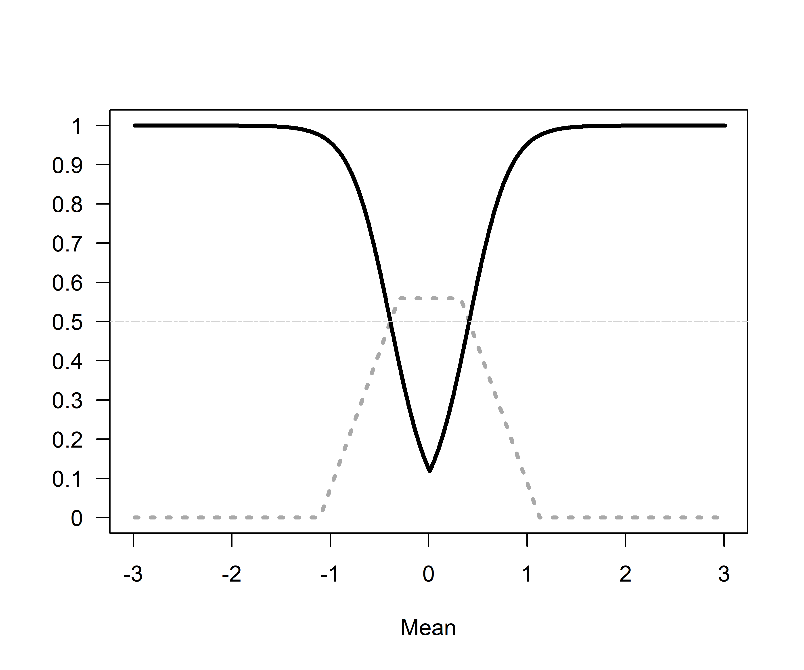

Equivalence Testing and the Second Generation P-Value
================
Daniël Lakens & Marie Delacre
28 juli 2018

The RMarkdown file with the reproducible code of this text is [here](https://github.com/Lakens/TOST_vs_SGPV/blob/master/sgpv_vs_TOST.Rmd).

The second generation *p*-value (SGPV) is a new descriptive statistic that was recently proposed to "improve rigor, reproducibility and transparency across science" (Blume, McGowan, Dupont, & Greevy, (2018). The SGPV is 'the proportion of data-supported hypotheses that are also null hypotheses'. The researcher specify an equivalence range around the null hypothesis that specifies values that are considered practically equivalent to the null-hypothesis. The SGPV is the proportion of the confidence interval (CI) around the observed effect estimate that falls within this equivalence range. If the CI falls completely inside the equivalence range the SGPV is 1, and if the CI falls completely outside the equivalence range the SGPV is 0.

The SGPV has strong similarities with an already existing approach known as equivalence testing (Lakens, 2017; Rogers, Howard, & Vessey, 1993). In an equivalence test, an equivalence range is based upon a smallest effect size of interest. In the Two One-Sided Tests (TOST) approach to equivalence testing data is tested against the upper and lower bounds of the equivalence range (e.g., a difference of -2 and +2). If both one-sided tests reject the presence of effects more extreme than the equivalence bounds we can act as if there is no meaningful effect. Because two one-sided tests are performed, equivalence can be declared when a 1-2\*alpha CI (e.g., when the alpha level is 0.05, a 90% CI) falls completely within the equivalence range of -2 and +2.

Surprisingly, Blume et al (2018) do not discuss equivalence testing in their article, despite the strong conceptual similarities. Here, we aim to examine the similarities and differences between equivalence testing using the TOST procedure and the SGPV. Our goal is to allow researchers to choose the statistic that best answers the question they are interested in.

The relationship between *p*-values from TOST and SGPV
======================================================

In the plot below *p*-values are calculated for the TOST equivalence testing procedure where a true population mean ranging from 140 to 150 is compared to the test value of 145 in a one-sample equivalence test where equivalence bounds are set to difference of -2 and +2 around the test value of 145. In other words, the equivalence range in the test contains all means between 143 and 147. Blume et al (2018) rely on the z-distribution, while to TOST package uses the *t*-distribution (which is more accurate at smaller sample sizes). To make sure the SGPV give basically identical results, sample sizes consist of 1000000 observations (for which the *t*-distribution and z-distribution are basically identical). The population standard deviation is set to 500 to still give some variation in responses. Our conclusions should hold to the same extend for more realistic numbers (e.g., N = 100, SD = 1).

 *Figure 1*: Comparison of *p*-values from TOST (black line) and SGPV (dotted grey line) across a range of true population means (x-axis) tested against a mean of 145 in a one-sample *t*-test with a sample size of 1000000 and a standard deviation of 500.

The SGPV treats the equivalence range as the null-hypothesis, while the TOST procedure treats the values outside of the equivalence range as the null-hypothesis. For ease of comparison we can reverse the SGPV (by calculating 1-SGPV) to make the two tests more comparable. We see that the *p*-value from the TOST procedure and the SGPV follow each other closely. 

*Figure 2*: Comparison of *p*-values from TOST (black line) and 1-SGPV (dotted grey line) across a range of true population means (x-axis) tested against a mean of 145 in a one-sample *t*-test with a sample size of 1000000 and a standard deviation of 500.

When the population mean is 145 and we are testing against equivalence bounds of 143 and 147 using the TOST procedure for a one-sample *t*-test with a sample size of 1000000 and a standard deviation of 500, the equivalence test is significant, *t*(999999) = 4, *p* = 0.0000317. Because the 95% CI falls completely within the equivalence bounds, the SGPV is 1 (see Figure 1).

One the other hand, if the observed mean is 140, the equivalence test is not significant (the observed mean is far outside the equivalence range of 143 to 147), *t*(999999) = -6, *p* = 1 (or more accurately, *p* &gt; .999 as *p*-values are bounded between 0 and 1). Because the 95% CI falls completely outside the equivalence bounds, the SGPV is 0 (see Figure 1).

SGPV as a uniform measure of overlap
------------------------------------

It is clear the SGPV and the *p*-value from TOST are closely related. We can think of the SGPV as a straight line that will always overlap the *p*-value from an equivalence test in 3 points. When the TOST *p*-value is 0.5, the SGPV is also 0.5 (note that the reverse is not true). The SGPV is 50% when the observed mean falls exactly on the lower or upper equivalence bound. When the observed mean equals the equivalence bound, the difference between the mean in the data and the equivalence bound is 0, the *t*-value for the equivalence test is also 0, and thus the *p*-value is 0.5 (situation A).

 *Figure 3*: Means, normal distribution, and 95% CI for three example datasets that illustrate the relationship between *p*-values from TOST and SGPV.

Two other points always have to overlap. When the 95% CI falls completely, but only just inside the equivalence region, the TOST (which relies on a one-sided test) should be significant at an alpha level of 0.025. When the SGPV changes from &lt;1 to 1 the 95% CI is exactly equal to one of the equivalence bounds (see situation B in the plot above, where the 95% CI falls completely inside the equivalence bounds) the TOST *p*-value is 0.025. The third point where the SGPV and the *p*-value from the TOST procedure should overlap is where the SGPV changes from a positive value (i.e., 0.0001) to 0 (when the 95% CI completely falls outside of the equivalence bound, see situation C in the plot above). When the 95% CI touches the outside of the equivalence bound and the TOST *p*-value will be 0.975.

The confidence interval width is a uniformly distributed across the mean differences, in the sense that as the true mean in a one-sample t-test gets closer to the test value (in the plot below, from situation A to D, the mean gets closer to the test value by 0.1) the difference in the overlap is stable.

 *Figure 4*: Means, normal distribution, and 95% CI for data with a sample size of 1000000 and a standard deviation of 500 for samples where the true population mean is 1.5, 1.4, 1.3, and 1.2.

For example, the SGPV from A to D is 0.7551064, 0.8061277, 0.857149, and 0.9081703. The difference in the percentage of overlap between A and B (-0.0510213) is identical to the difference in the percentage of overlap between C and D as the mean gets 0.1 closer to the test value (-0.0510213).

As we move the means closer to the test value in steps of 0.1 across A to D the *p*-value calculated for normally distributed data is not uniformly distributed. The probability of observing data more extreme than the upper bound of 2 is (from A to D) 0.1586553, 0.1150697, 0.0807567, and 0.0547993. As we can see, the difference between A and B (0.0435856) is not the same as the difference between C And D (0.0259574). Indeed, the difference in *p*-values is the largest as you start at *p* = 0.5 (when the observed mean falls on the test value), which is why the line in Figure 1 is the steepest at *p* = 0.5. Note that where the SGPV reaches 1 or 0, *p*-values closely approximate 0 and 1, but never reach these values.

When are the SGPV and Equivalence Test Unrelated?
-------------------------------------------------

There are 4 situations where *p*-values from TOST and SGPV are unrelated. The first two situations were discussed earlier, and can be seen in Figure 1. When the SGPV is either 0 or 1 *p*-values from the equivalence test fall between 0.975 and 1 or between 0 and 0.025. Because p-values approach 0 or 1, but are never exactly 0 or 1, while the SGPV is exactly 0 or 1, the two statistics are completely unrelated. The easiest way to see this is by plotting the SGPV against the *p*-value from the TOST procedure. The situations where the SPGV and *p*-values from the TOST procedure are unrelated are indicated by the parts of the curve where there are vertical lines at SGPV of 0 and 1.

 *Figure 5*: The relationship between *p*-values from the TOST procedure and the SGPV for the same scenario as in Figure 1.

A third situation in which the SGPV deviates strongly from the TOST *p*-value is whenever the CI is more than twice as wide as the equivalence range, and the CI overlaps with the upper *and* lower equivalence bound. In this situation the normal calculation of the proportion of overlap is skipped, and the SGPV is set to 0.5 instead. Blume et al. (2018) call this the 'small sample correction factor'. However, it is not a correction in the typical sense of the word, since the SGPV is not adjusted to any 'correct' value. When the normal calculation would be 'misleading' (i.e., the SGPV would be small, which normally would suggest support for the alternative hypothesis, when all values in the equivalence range are also supported), the SGPV is set to 0.5 which according to Blume and colleagues signal the SGPV is 'uninformative'. Note that the CI can be twice as wide as the equivalence range whenever the sample size is small (and the confidence interval width is large) *or* when then equivalence range is narrow. It is therefore not so much a 'small sample correction' as it is an exception to the typical calculation of the SGPV whenever the ratio of the confidence interval width to the equivalence range exceeds 2:1 and the CI overlaps with the upper and lower bounds.

We can examine this situation by calculating the SGPV and performing the TOST for a situation where sample sizes are small and the equivalence range is narrow, such that the CI is more than twice as large as the equivalence range.

 *Figure 6*: Comparison of *p*-values from TOST (black line) and SGPV (dotted grey line) across a range of true population means (x-axis). Because the sample size is small (n = 10) and the CI is more than twice as wide as the equivalence range (set to -0.4 to 0.4), the SGPV is set to 0.5 (horizontal lightgrey line) across a range of observed means.

We can again plot the two statistics against each other so see where they are unrelated (indicated by straight lines in the curve). We see the SGPV is 0.5 for a range of observed means where the p-value from the equivalence test still varies. It should be noted that in these calculations the *p*-values for the TOST procedure are *never* smaller than 0.05 (i.e., they do not get below 0.05 on the y-axis). In other words, we can't conclude equivalence based on any of the observed means. How is this possible? Remember that the TOST procedure consists of two one-sided tests against the upper and lower equivalence bound. The TOST *p*-value is smaller than 0.05 if the 90% CI falls completely between the upper and lower equivalence bounds. However, we are examining a scenario where the 90% CI is so wide that it never falls completely within the two equivalence bounds. As Lakens (2017) notes: “in small samples (where CIs are wide), a study might have no statistical power (i.e., the CI will always be so wide that it is necessarily wider than the equivalence bounds).” None of the *p*-values based on the TOST procedure are below 0.05, and thus, in the long run we have 0% power.  *Figure 7*: The relationship between *p*-values from the TOST procedure and the SGPV for the same scenario as in Figure 6.

There is one last situation where the *p*-value from the TOST procedure and the SGPV are unrelated. This is when the CI is wider than the equivalence range (so the precision is low) and overlaps with the upper and lower equivalence bound, but the CI is *not* twice as wide as the equivalence range. This fourth category exists because of the decision by Blume and colleagues to set the SGPV to 0.5 whenever the CI is twice as wide as the equivalence range and the CI overlaps with both equivalence bounds. This means that there are situations where the CI interval overlaps with both equivalence bounds, while the CI is less than twice as large as the equivalence bound. For example, in the example below, we see that the CI is only 1.79 times as wide as the equivalence bounds, but the CI overlaps with the lower and upper equivalence bounds.

 *Figure 8*: Example of a 95% CI that overlaps with the lower and upper equivalence bound (indicated by the vertical dotted lines).

If the observed mean would be somewhat closer to 0, or further away from 0, the SGPV would remain constant (the CI width does not change, it completely overlaps with the equivalence range) while the *p*-value for the TOST procedure can vary between 0 and .025. We can see this in Figure 9 below. The SGPV is not set to 0.5, but is slightly higher than 0.5 across a range of means. How high the SGPV will be when the CI overlaps with the lower and upper equivalence bounds, but the CI is not twice as large as the equivalence range, depends on the width of the CI and the equivalence range.

 *Figure 9*: Comparison of *p*-values from TOST (black line) and SGPV (dotted grey line) across a range of true population means (x-axis). The sample size is small (n = 10), but because the sd is half as big as in Figure 7 (1 instead of 2) the CI is less than twice as wide as the equivalence range (set to -0.4 to 0.4). The SGPV is not set to 0.5 (horizontal lightgrey line) but reaches a maximum slightly above 0.5 across a range of observed means.

If we once more plot the two statistics against each other so see where they are unrelated (indicated by straight lines in the curve). We see the SGPV is 0.56 for a range of observed means where the *p*-value from the equivalence test still varies.  *Figure 10*: The relationship between *p*-values from the TOST procedure and the SGPV for the same scenario as in Figure 9.

To conclude this section, there are four situations where the *p*-value from the TOST procedure is unrelated to the SGPV. In all these situations the *p*-value for the equivalence test differentiates tests with different means, but the SGPV does not. Therefore, as a purely descriptive statistic, the SGPV is more limited than the value from the TOST procedure. The proportion of overlap can be the same value when the observed mean is 0 or when the observed mean falls just inside the equivalence bound, and additional information (e.g., the 95% CI) is required to differentiate these situations. One way to mitigate this limitation of the SGPV would be to set the SGPV to 0.5 whenever the CI overlaps with both the upper and lower equivalence bound (irrespective of the width of the CI).

What are the Relative Strengths and Weaknesses of Equivalence Testing and SGPV?
-------------------------------------------------------------------------------

Given the strong relationship between SGPV and equivalence testing, a logical question is to ask what the introduction of SGPV adds to the existing statistical approaches, including equivalence tests, and what the relative strengths and weaknesses of either approach are. First of all, SGPV is a descriptive statistic (unlike the *p*-value that is calculated for an equivalence test, which is an inferential statistic). It numerically summarizes the information that is visually present in a plot (such as Figure 3) displaying the equivalence range and the 95% CI around the observed effect.

The SGPV is 1 for tests where *p*-values for the TOST procedure differ. For example, different equivalence tests with *p* = 0.024 and *p* = 0.0001 have a SGPV of 1. Although a SGPV of 1 or 0 has a clear interpretation (we can reject effects outside or inside the equivalence range) intermediate values are not as easy to interpret (e.g., it is unclear how we would interpret a SGPV of 0.56 versus 0.65). Since the SGPV is always directly related to a *p*-value from the TOST procedure, different SGPV can be interpreted in the same manner as different *p*-values. From a Fisherian viewpoint, the lower the *p*-value, the worse the fit of the data with a specific model, and analogously, the lower the SGPV the worse the fit of the data with the equivalence range. From a Neyman-Pearson approach to statistics, only the dichotomous rejection of values outside of the equivalence range (TOST *p* &lt; *α* or SGPV = 1) allows you to act as if the null-hypothesis is true while controlling our error rate at a known maximum.

\[To be extended\]

Discussion
==========

It seems Blume et al (2018) where not aware of the existence of equivalence tests, and we believe that our explanation of the similarities between the TOST procedure and the SGPV provides some useful context to interpret the contribution of second generation *p*-values to the statistical toolbox. The novelty lies in its use as a descriptive statistic. The added benefit of calculating the proportion of overlap of a 95% CI with the equivalence range, and using this percentage to describe the data, remains somewhat unclear for practical purposes. Nevertheless, our only goal is to clarify the relationship between a newly proposed statistic and the already existing TOST approach used to test for equivalence, and let researchers make an informed decision about which statistical approach provides the best answer to their question.

References
==========

Blume, J. D., McGowan, L. D., Dupont, W. D., & Greevy, R. A. (2018). Second-generation *p*-values: Improved rigor, reproducibility, & transparency in statistical analyses. PLOS ONE, 13(3), e0188299. <https://doi.org/10.1371/journal.pone.0188299>

Lakens, D. (2017). Equivalence Tests: A Practical Primer for t Tests, Correlations, and Meta-Analyses. Social Psychological and Personality Science, 8(4), 355–362. <https://doi.org/10.1177/1948550617697177>

Rogers, J. L., Howard, K. I., & Vessey, J. T. (1993). Using significance tests to evaluate equivalence between two experimental groups. Psychological Bulletin, 113(3), 553–565. <http://dx.doi.org/10.1037/0033-2909.113.3.553>
