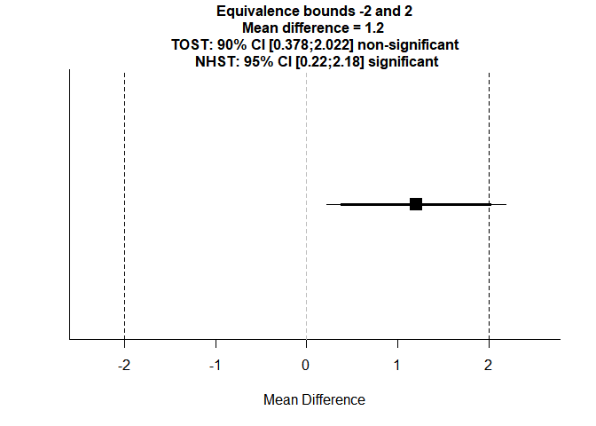

Equivalence Testing and the Second Generation P-Value
================
Daniël Lakens & Marie Delacre
1 juli 2018

The second generation p-value (SGPV) is the proportion of data-supported hypotheses that are also null hypotheses (Blume, McGowan, Dupont, & Greevy, (2018). The authors note that: "Using second-generation p-values can only improve rigor, reproducibility and transparency across science." It was quickly noted on Twitter that the SGPV is similar to equivalence testing (<https://twitter.com/statsepi/status/997759878503550976>, <https://twitter.com/lakens/status/995171827692515328>).

In the plot below I calculate p-values for the TOST equivalence testing procedure, and plot the SGPV for the same tests:


For ease of comparison, let me repeat the plot, now showing 1-TOST p-values:


It is clear there is overlap. Some orientation in this plot. When the TOST p-value is 0.5, the SGPV is 0.5. This is because when the 95% CI overlaps 50% with the equivalence region, it falls exactly on the lowerbound. When this is the case, the probability of observing data as or more extreme as the data observed is also exactly 50%, and thus the TOST p-value is 0.5 as well.

Two other points always have to overlap. When the 95% CI falls completely inside the equivalence region, The TOST using a 95% (instead of the typical 90% CI) should be significant at the 5% level. Since TOST in this simulation uses a 90% CI, we can halve the alpha level, and thus we should expect that when the SGPV is is 1, and the 95% just touches the lower bound (around index 558) the TOST p-value is 2.5% (or 1-0.025=0.975 in the second plot). The opposite is also true: When the SGPV is changes from 0 to a positive value (around index 245) the 95% CI touches the outside of the lower bound, and the TOST p-value will be 0.975 (or in the lower plot showing 1-p\_TOST, 0.025).

We can see SGPV is a straight line between these points, because each trial, the observed difference moves from m = 140 to 146 in steps of 0.01. When m = 146, there is perfect equivalence (since we are testing against a value of 146 in the one-sided test).

The only thing we need to explain is why the TOST p-value is curved, where the SGPV is a straight line as we reduce the mean difference with 0.01 steps as the index increases. The difference is that SGPV is a proportion from 0 to 1 (with it being 0 when there is no overlap, and 1 if there is perfect overlap) while the TOST p-value is a probability, which is never exactly 0 or one (but can get really close).

Let's look at an example, and write in full the calculation for the SGPV. We should be able to link it to the calculation for the TOST p-value.

``` r
m <- 146
mu <- 144.5
sd <- 500
n <- 1000000
low_eqbound = -2 
high_eqbound = 2 
alpha = 0.05

tost_res <- TOSTone.raw(m = m, 
                   mu = mu,
                   sd = sd, 
                   n = n, 
                   low_eqbound = low_eqbound, 
                   high_eqbound = high_eqbound, 
                   alpha = alpha
)
```

    ## Using alpha = 0.05 the NHST one-sample t-test was significant, t(999999) = 3, p = 0.002699863

    ## 

    ## 
    ## Using alpha = 0.05 the equivalence test was non-significant, t(999999) = -1, p = 0.1586554

    ## 


    ## TOST results:
    ##   t-value 1    p-value 1 t-value 2 p-value 2     df
    ## 1         7 1.280612e-12        -1 0.1586554 999999
    ## 
    ## Equivalence bounds (raw scores):
    ##   low bound raw high bound raw
    ## 1            -2              2
    ## 
    ## TOST confidence interval:
    ##   Lower Limit 90% CI raw Upper Limit 90% CI raw
    ## 1              0.6775724               2.322428

``` r
TOST_to_SGPV(tost_res = tost_res)
```

    ## [1] 0.7551064

The confidence interval width is a uniformly distributed across the mean differences, in the sense that as the true mean in a one-sample t-test gets closer to the test value (in the plot below, from situation A to D, the mean gets closer to the test value by 0.1) the difference in the overlap is stable.

``` r
m <- 146
mu <- 144.5
sd <- 500
n <- 1000000
low_eqbound = -2 
high_eqbound = 2 
alpha = 0.05

tost_res1 <- TOSTone.raw(m = m, 
                   mu = mu,
                   sd = sd, 
                   n = n, 
                   low_eqbound = low_eqbound, 
                   high_eqbound = high_eqbound, 
                   alpha = alpha
)
```

    ## Using alpha = 0.05 the NHST one-sample t-test was significant, t(999999) = 3, p = 0.002699863

    ## 

    ## 
    ## Using alpha = 0.05 the equivalence test was non-significant, t(999999) = -1, p = 0.1586554

    ## 


    ## TOST results:
    ##   t-value 1    p-value 1 t-value 2 p-value 2     df
    ## 1         7 1.280612e-12        -1 0.1586554 999999
    ## 
    ## Equivalence bounds (raw scores):
    ##   low bound raw high bound raw
    ## 1            -2              2
    ## 
    ## TOST confidence interval:
    ##   Lower Limit 90% CI raw Upper Limit 90% CI raw
    ## 1              0.6775724               2.322428

``` r
SGPV1 <- TOST_to_SGPV(tost_res = tost_res1)

m <- 145.9
mu <- 144.5
sd <- 500
n <- 1000000
low_eqbound = -2 
high_eqbound = 2 
alpha = 0.05

tost_res2 <- TOSTone.raw(m = m, 
                   mu = mu,
                   sd = sd, 
                   n = n, 
                   low_eqbound = low_eqbound, 
                   high_eqbound = high_eqbound, 
                   alpha = alpha
)
```

    ## Using alpha = 0.05 the NHST one-sample t-test was significant, t(999999) = 2.8, p = 0.005110359

    ## 

    ## 
    ## Using alpha = 0.05 the equivalence test was non-significant, t(999999) = -1.2, p = 0.1150698

    ## 


    ## TOST results:
    ##   t-value 1    p-value 1 t-value 2 p-value 2     df
    ## 1       6.8 5.233874e-12      -1.2 0.1150698 999999
    ## 
    ## Equivalence bounds (raw scores):
    ##   low bound raw high bound raw
    ## 1            -2              2
    ## 
    ## TOST confidence interval:
    ##   Lower Limit 90% CI raw Upper Limit 90% CI raw
    ## 1              0.5775724               2.222428

``` r
SGPV2 <- TOST_to_SGPV(tost_res = tost_res2)

m <- 145.8
mu <- 144.5
sd <- 500
n <- 1000000
low_eqbound = -2 
high_eqbound = 2 
alpha = 0.05

tost_res3 <- TOSTone.raw(m = m, 
                   mu = mu,
                   sd = sd, 
                   n = n, 
                   low_eqbound = low_eqbound, 
                   high_eqbound = high_eqbound, 
                   alpha = alpha
)
```

    ## Using alpha = 0.05 the NHST one-sample t-test was significant, t(999999) = 2.6, p = 0.009322513

    ## 

    ## 
    ## Using alpha = 0.05 the equivalence test was non-significant, t(999999) = -1.4, p = 0.08075681

    ## 


    ## TOST results:
    ##   t-value 1    p-value 1 t-value 2  p-value 2     df
    ## 1       6.6 2.056809e-11      -1.4 0.08075681 999999
    ## 
    ## Equivalence bounds (raw scores):
    ##   low bound raw high bound raw
    ## 1            -2              2
    ## 
    ## TOST confidence interval:
    ##   Lower Limit 90% CI raw Upper Limit 90% CI raw
    ## 1              0.4775724               2.122428

``` r
SGPV3 <- TOST_to_SGPV(tost_res = tost_res3)

m <- 145.7
mu <- 144.5
sd <- 500
n <- 1000000
low_eqbound = -2 
high_eqbound = 2 
alpha = 0.05

tost_res4 <- TOSTone.raw(m = m, 
                   mu = mu,
                   sd = sd, 
                   n = n, 
                   low_eqbound = low_eqbound, 
                   high_eqbound = high_eqbound, 
                   alpha = alpha
)
```

    ## Using alpha = 0.05 the NHST one-sample t-test was significant, t(999999) = 2.4, p = 0.01639525

    ## 

    ## 
    ## Using alpha = 0.05 the equivalence test was non-significant, t(999999) = -1.6, p = 0.05479945

    ## 



    ## TOST results:
    ##   t-value 1    p-value 1 t-value 2  p-value 2     df
    ## 1       6.4 7.772264e-11      -1.6 0.05479945 999999
    ## 
    ## Equivalence bounds (raw scores):
    ##   low bound raw high bound raw
    ## 1            -2              2
    ## 
    ## TOST confidence interval:
    ##   Lower Limit 90% CI raw Upper Limit 90% CI raw
    ## 1              0.3775724               2.022428

``` r
SGPV4 <- TOST_to_SGPV(tost_res = tost_res4)

0.7551064 - 0.7040851
```

    ## [1] 0.0510213

``` r
0.6530639 - 0.6020426
```

    ## [1] 0.0510213

``` r
plot(NA, 
     ylim = c(0, 1), 
     xlim = c(-3, 3),
     yaxt = "n",
     ylab = "",
     xlab = "Mean Difference")
axis(2, at = c(0.2,0.4,0.6,0.8), labels = c("D", "C", "B", "A"), las = 1)
abline(v = tost_res1$high_eqbound, 
       lty = 2)
abline(v = tost_res1$low_eqbound, 
       lty = 2)
abline(v = 0, 
       lty = 2, 
       col = "grey")

points(x = tost_res4$diff, 
       y = 0.2, 
       pch = 15, 
       cex = 2)
segments(tost_res4$LL_CI_TOST, 
         0.2, 
         tost_res4$UL_CI_TOST, 
         0.2, 
         lwd = 3)


points(x = tost_res3$diff, 
       y = 0.4, 
       pch = 15, 
       cex = 2)
segments(tost_res3$LL_CI_TOST, 
         0.4, 
         tost_res3$UL_CI_TOST, 
         0.4, 
         lwd = 3)

points(x = tost_res2$diff, 
       y = 0.6, 
       pch = 15, 
       cex = 2)
segments(tost_res2$LL_CI_TOST, 
         0.6, 
         tost_res2$UL_CI_TOST, 
         0.6, 
         lwd = 3)

points(x = tost_res1$diff, 
       y = 0.8, 
       pch = 15, 
       cex = 2)
segments(tost_res1$LL_CI_TOST, 
         0.8, 
         tost_res1$UL_CI_TOST, 
         0.8, 
         lwd = 3)
```


For example, the SGPV from A to D is 0.7551064, 0.8061277, 0.857149, and 0.9081703. The difference in the percentage of overlap between A and B (-0.0510213) is identical to the difference in the percentage of overlap between C and D as the mean gets 0.1 closer to the test value (-0.0510213).

References
==========

Blume, J. D., McGowan, L. D., Dupont, W. D., & Greevy, R. A. (2018). Second-generation p-values: Improved rigor, reproducibility, & transparency in statistical analyses. PLOS ONE, 13(3), e0188299. <https://doi.org/10.1371/journal.pone.0188299>
