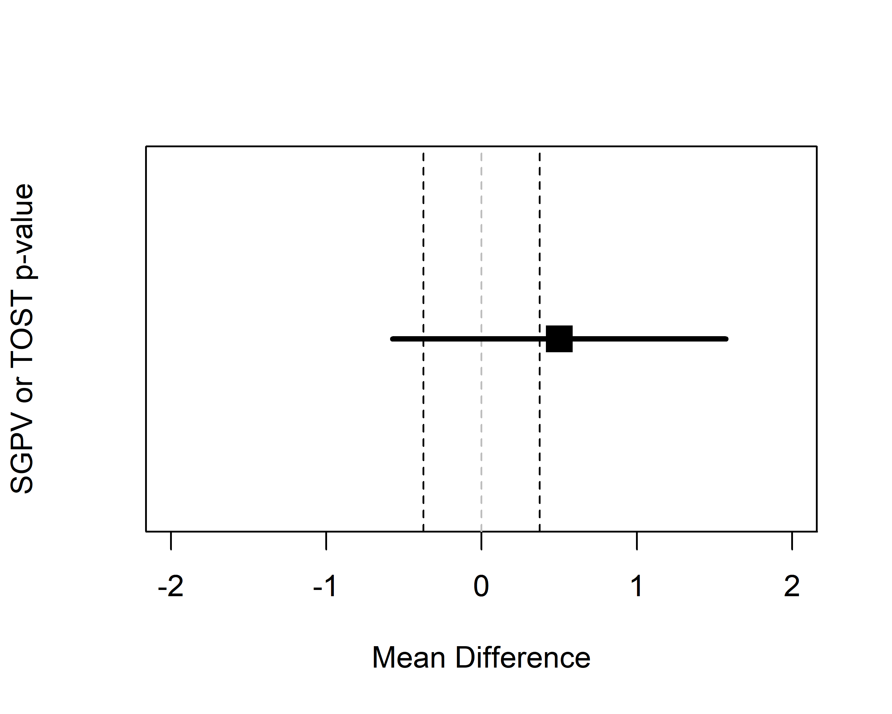
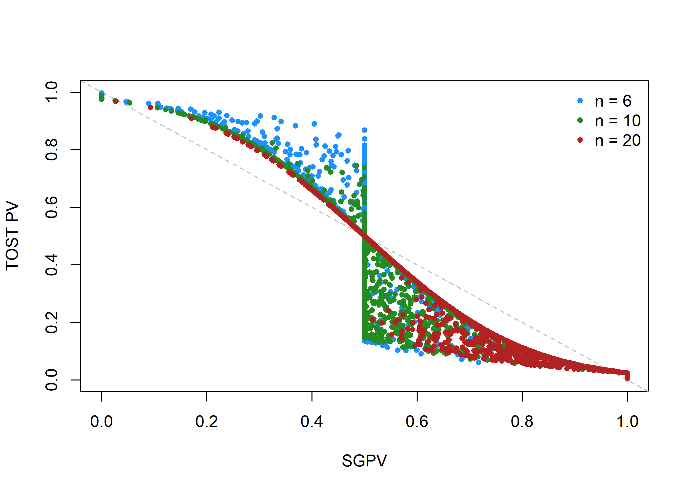
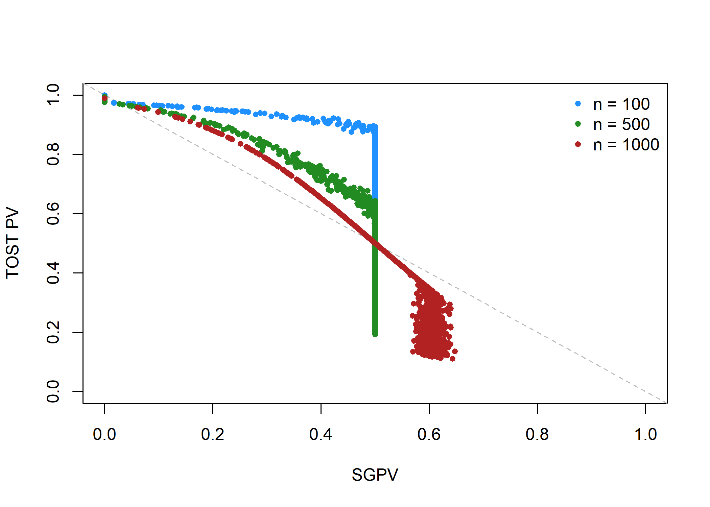
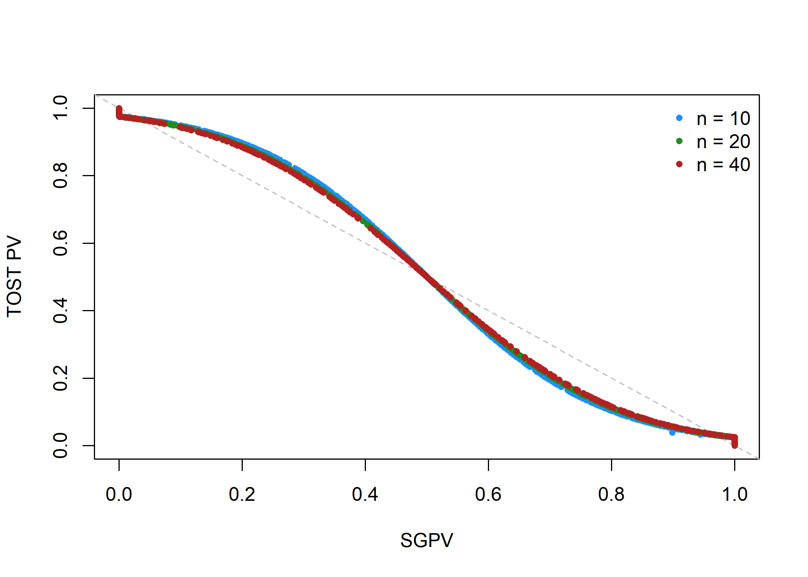
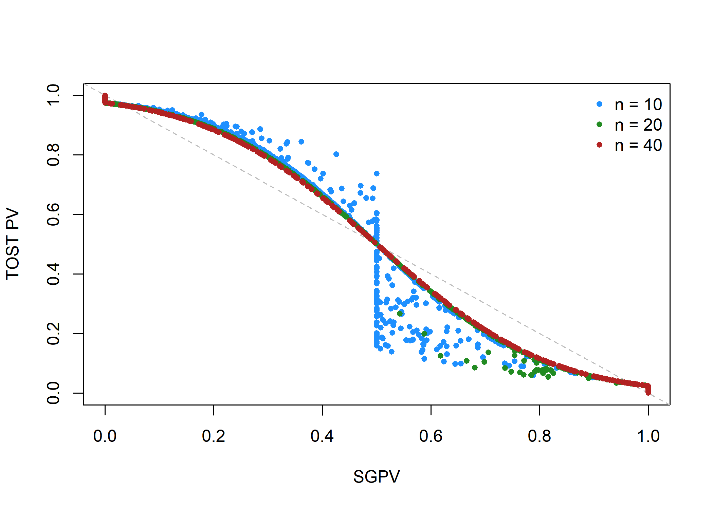

A Closer Look at SGPV's Small Sample Correction
================
Daniël Lakens & Marie Delacre
27 juli 2018

Although the *p*-value from the TOST procedure follows the SGPV closely in the examples we discussed earlier, there is one situation in which the SGPV deviates strongly from the TOST *p*-value. Whenever the CI is more than twice as wide as the equivalence range, and the CI overlaps with the upper *and* lower equivalence bound, the normal calculation of the proportion of overlap is skipped, and the SGPV is set to 0.5 instead. Blume et al. (2018) call this the 'small sample correction factor'. However, it is not a correction in the typical use of the word, since the SGPV is not adjusted to any 'correct' value. When the normal calculation would be 'misleading' (i.e., the SGPV would be small, which normally would suggest support for the alternative hypothesis, when all values in the equivalence range are also supported), the SGPV is set to 0.5 which according to Blume ete a. (2018) signal the SGPV is 'uninformative'. Note that the CI can be twice as wide as the equivalence range whenever the sample size is small (and the confidence interval width is large) *or* when then equivalence range is narrow. It is therefore not so much a 'small sample correction' as it is an exception to the typical calculation of the SGPV whenever the ratio of the confidence interval width to the equivalence range exceeds 2:1 and the CI overlaps with the upper and lower bounds.

 *Figure 1*: Example of a 95% CI that overlaps with the lower and upper equivalence bound (indicated by the vertical dotted lines).

Blume et al. (2018) sent through code that simulates 1000 tests with 6, 10, or 20 subjects, where means are normally distributed with a mean of 0 and a sd of 1, the equivalence range is set from -0.375 to 0.375, and a one-sample t-test is performed against 0. The figure below shows the relationship between the SGPV and the p-value from the TOST procedure.

 *Figure 2*: Result of simulation showing when p-values from TOST differ from the SGPV.

To understand Figure 2 better, it makes sense to re-run the simulation with slightly larger sample size to distinguish two factors that contribute to the observed pattern, and to better understand the relationship between p-values from the TOST procedure and the SGPV whenever the ratio of the confidence interval width to the equivalence range exceeds 2:1.

 *Figure 3*: Reproduced Figure 2, but with larger sample sizes and larger standard deviation.

First of all, it should be noted that in this simulation the *p*-values for the TOST procedure have a lower bound, and the p-values for the equivalence test are not smaller than 0.05 for sample sizes of 100, 500, and 1000 per group (i.e., they do not get below 0.05 on the y-axis). In other words, we can *never* conclude equivalence based on any of the 1000 studies we simulated. How is this possible? Remember that the TOST procedure consists of two one-sided tests against the upper and lower equivalence bound. The TOST p-value is smaller than 0.05 if the 90% CI falls completely between the upper and lower equivalence bounds. However, we are simulating data where the 90% CI is so wide it never falls completely within the two equivalence bounds. As Lakens (2017) notes: “in small samples (where CIs are wide), a study might have no statistical power (i.e., the CI will always be so wide that it is necessarily wider than the equivalence bounds).” This is the situation in the simulation. None of the *p*-values based on the TOST procedure are below 0.05, and thus, in the long run we have 0% power.

For the SGPV we know that it is set to 0.5 whenever the CI is twice as wide as the equivalence range, and the CI overlaps with the upper and lower equivalence bound. When we start at the left end of the x-axis we see that the SGPV can be 0 (i.e., fall completely outside of the equivalence range). The SGPV becomes smaller as the 95% CI starts to overlap with one of the equivaence bounds. However, where the SGPV would be 0.5 only when the observed mean falls exactly on one of the equivalence bounds, it now is set to 0.5 earlier. The wide 95% CI implies that well before the observed mean has moved close enough to fall on the equivalence bound, the confidence interval overlaps with both of the equivalence bounds (see Figure 1). We see this in Figure 3, where the SGVP increases up until the point where the CI overlaps with the upper and lower equivalence bounds - at which point the SGPV is set to 0.5. The smaller the CI (or the larger the sample size, all else equal) the smaller the TOST *p*-value is before the SGPV is set to 0.5.

Now that we have explained on pattern that leads to the variation in the plot by Jeffrey Blume, we need to turn to the second source of variation. First, we slightly adapt the original code by making the equivalence bound wider (from -1 to 1), adding a constant to the simulated data (from -2 to 2) to simulate data when there is a true effect (this is such that we have data for the entire range of SGPV and TOT p-values), and setting sample sizes to 10, 20 and 40. We see a regular curve as we have seen before.

 We then repeat the simulation, now setting the equivalence bounds to a more narrow -0.4 to 0.4 range. Everything else is identical to the plot above.

